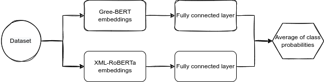
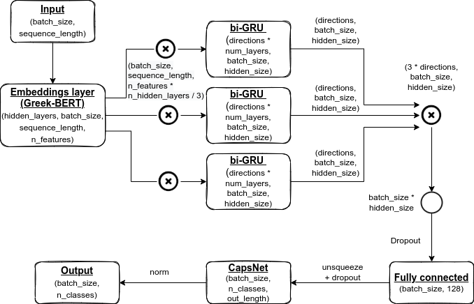

### Aspect-Based Sentiment Analysis in Greek Data

In this repo you can find the final (best) thesis experiments that were conducted for my MSc degree in Artificial Intelligenece. The methodology tackles the problem of aspect-based sentiment analysis in low resource languages and specifically in Greek. The dataset was derived from Twitter and both aspects and labels were carefully chosen manually by human annotators. 

If you want access to all the experiments just reach me at aivagiorgos@gmail.com.

#### * Abstract *
Due to the exponential growth of data the recent years, many businesses and organizations seek innovative techniques in order to collect and understand data. Since they are most interested in the public opinion for their products and services they implement methodologies for sentiment classification. These techniques are part of Sentiment Analysis and Natural Language Processing with the goal to automatically understand the sentiment given a corpus. Although the proliferation of text documents caused problems in the last decade that were mostly related to computational resources, nowadays we are able to analyze data more efficiently due to the Deep Learning architectures. However, many languages are characterized as low-resources languages due to the limited data that are available online for analysis. For this reason in this thesis an aspect-based Sentiment Analysis methodology is presented, targeting to classify the aspects of a sentence into pre-defined sentiment categories. Specifically, the dataset of this study is written in the Greek language and was collected from social networks like Twitter. Moreover, the labels, both aspects and sentiments, were manually chosen from expert annotators. Furthermore, various language models and deep learning architectures were developed and tested. Finally, the results of the best architecture, which is a combination of neural machine translation and a language-model ensemble methodology clearly proved the necessity of neural machine translation for imbalanced data and the superiority of the Transformer-based ensemble architectures achieving ambitious results for the problem of aspect-based Sentiment Analysis in low-resource languages.

#### * Data *
The format of the data is the following:

| text | target | sentiment |
| :---: | :---: | :---: |
| str | str | str |

The text column contains the tweets, the target column contains the aspect extracted from the tweets, and the sentiment column contains the polarity of the tweet regarding the aspect and has one of the following five values: -2 (very negative), -1 (negative), 0 (neutral), 1 (positive), 2 (very positive).
Keep in mind that the dataset should be unrolled, meaning that for a given text, only one target and one sentiment should be used. The mechanism for checking and unrolling the dataset is not included in this repo.

#### * Architectures *

The ensemble architecture consists of the Greek-BERT and XML-RoBERTa and two additional fully connected layers.



The hybrid architecture consists of the Greek-BERT, three bi-GRUs, a fully connected layer, and a CapsNet layer alongside three aditional fully connected layer as the ensemble classifiers. (Note: the ensemble approach of the hybrid architecture is not depicted on the figure.)




#### * Requirements *
The environment of the experiments was implemented using Anaconcda. In general, python and pytorch are required and some additional packages that can be found inside the environment.yml file.

#### * How to run *

Given the dataset as a csv file to the corresponding folder, after just "cd" to the appropriate methodology and run:
```console
foo@bar:~$ python3 main.py
```
Please note that if the dataset is in a language rather than the Greek, you should change the source language of the machine translator from the main.py and from utils/data_prep.py files. By default, the source and the target languages are set in Greek, with two intermidiate languages for translations, French and Enligsh.
Moreover, you should find an appropriate BERT lanauge model for your langauge and configure it on the main.py files.

#### * Results *

<table>
<tr><th> Ensemble methodology </th><th> Hybrid methodology </th></tr>
<tr><td>
  
| Class  | F1-score |
| ------------- | ------------- |
| negative | 0.69  |
| neutral  | 0.85  |
| positive  | 0.54  |

</td><td>

| Class  | F1-score |
| ------------- | ------------- |
| negative | 0.62  |
| neutral  | 0.82  |
| positive  | 0.54  |

</td></tr> </table>
